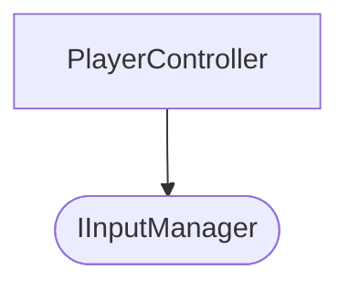

# GDC CLI 사용 가이드

GDC(Graph-Driven Codebase) CLI의 상세한 사용법을 설명합니다.

## 목차

- [전역 옵션](#전역-옵션)
- [명령어 목록](#명령어-목록)
  - [gdc init](#gdc-init)
  - [gdc node](#gdc-node)
  - [gdc list](#gdc-list)
  - [gdc show](#gdc-show)
  - [gdc sync](#gdc-sync)
  - [gdc check](#gdc-check)
  - [gdc extract](#gdc-extract)
  - [gdc trace](#gdc-trace)
  - [gdc graph](#gdc-graph)
  - [gdc stats](#gdc-stats)
  - [gdc version](#gdc-version)

---

## 전역 옵션

모든 GDC 명령어에서 사용할 수 있는 공통 옵션입니다.

| 옵션 | 축약형 | 설명 | 기본값 |
|------|--------|------|--------|
| `--config` | `-c` | 설정 파일 경로 | `.gdc/config.yaml` |
| `--verbose` | `-v` | 상세 출력 모드 | `false` |
| `--quiet` | `-q` | 최소 출력 모드 | `false` |
| `--json` | - | JSON 형식으로 출력 | `false` |
| `--no-color` | - | 컬러 출력 비활성화 | `false` |

---

## 명령어 목록

### gdc init

새로운 GDC 프로젝트를 초기화합니다.

#### 사용법

```bash
gdc init [옵션]
```

#### 옵션

| 옵션 | 축약형 | 설명 | 기본값 |
|------|--------|------|--------|
| `--language` | `-l` | 주 프로그래밍 언어 | `csharp` |
| `--storage` | `-s` | 저장 모드 (`centralized`, `distributed`) | `centralized` |

#### 지원 언어

- `csharp` (C#)
- `typescript` (TypeScript)
- `go` (Go/Golang)
- `python` (Python)
- `java` (Java)

#### 생성되는 구조

```
.gdc/
├── config.yaml        # 프로젝트 설정
├── graph.db           # SQLite 데이터베이스
├── nodes/             # 노드 명세 저장소
└── templates/         # 프롬프트 템플릿
      └── implement.md.j2
```

#### 예시

```bash
# 기본 초기화 (C#)
gdc init

# TypeScript 프로젝트 초기화
gdc init --language typescript

# Go 프로젝트 초기화 (분산 저장 모드)
gdc init --language go --storage distributed
```

---

### gdc node

노드 명세를 관리합니다. (생성, 삭제, 이름 변경)

#### 하위 명령어

##### gdc node create

새로운 노드 명세 파일을 생성합니다.

```bash
gdc node create <name> [옵션]
```

| 옵션 | 축약형 | 설명 | 기본값 |
|------|--------|------|--------|
| `--type` | `-t` | 노드 타입 | `class` |
| `--layer` | `-l` | 아키텍처 레이어 | `application` |

**노드 타입:**
- `class` - 일반 클래스
- `interface` - 인터페이스
- `service` - 서비스 클래스
- `module` - 모듈
- `enum` - 열거형

**아키텍처 레이어:**
- `domain` - 도메인 레이어
- `application` - 애플리케이션 레이어
- `infrastructure` - 인프라 레이어
- `presentation` - 프레젠테이션 레이어

**예시:**

```bash
# 기본 클래스 노드 생성
gdc node create PlayerController

# 인터페이스 노드 생성
gdc node create IInputManager --type interface

# 도메인 레이어의 서비스 노드 생성
gdc node create GameService --type service --layer domain
```

##### gdc node delete

노드 명세 파일을 삭제합니다.

```bash
gdc node delete <name>
```

**예시:**

```bash
gdc node delete OldController
```

##### gdc node rename

노드 이름을 변경합니다.

```bash
gdc node rename <old-name> <new-name>
```

**예시:**

```bash
gdc node rename PlayerController CharacterController
```

> ⚠️ **주의:** 이름 변경 후 다른 노드에서 참조하는 부분은 수동으로 업데이트해야 합니다.

---

### gdc list

프로젝트의 모든 노드를 조회합니다.

#### 사용법

```bash
gdc list [옵션]
```

**별칭:** `gdc ls`

#### 옵션

| 옵션 | 축약형 | 설명 | 기본값 |
|------|--------|------|--------|
| `--filter` | `-f` | 필터 표현식 | - |
| `--sort` | `-s` | 정렬 기준 (`name`, `type`, `layer`, `status`) | `name` |
| `--format` | - | 출력 형식 (`table`, `json`, `minimal`) | `table` |

#### 필터 표현식

`key=value` 형식으로 필터링:

- `layer=domain` - 도메인 레이어만
- `type=interface` - 인터페이스만
- `status=implemented` - 구현된 노드만
- `tag=core` - 특정 태그가 있는 노드만

#### 예시

```bash
# 전체 노드 목록
gdc list

# 인터페이스만 필터링
gdc list --filter "type=interface"

# 도메인 레이어만 필터링
gdc list --filter "layer=domain"

# JSON 형식 출력
gdc list --format json

# 노드 이름만 출력
gdc list --format minimal
```

---

### gdc show

특정 노드의 상세 정보를 조회합니다.

#### 사용법

```bash
gdc show <node> [옵션]
```

#### 옵션

| 옵션 | 축약형 | 설명 | 기본값 |
|------|--------|------|--------|
| `--deps` | `-d` | 의존성 표시 | `false` |
| `--refs` | `-r` | 참조하는 노드 표시 | `false` |
| `--full` | `-F` | 전체 명세 표시 | `false` |
| `--interface-only` | `-i` | 인터페이스만 표시 | `false` |

#### 예시

```bash
# 기본 정보 조회
gdc show PlayerController

# 의존성과 참조 함께 조회
gdc show PlayerController --deps --refs

# 전체 명세 조회
gdc show PlayerController --full

# 인터페이스 코드만 출력
gdc show IInputManager --interface-only
```

---

### gdc sync

YAML 명세와 데이터베이스를 동기화합니다.

#### 사용법

```bash
gdc sync [옵션]
```

#### 옵션

| 옵션 | 축약형 | 설명 | 기본값 |
|------|--------|------|--------|
| `--dry-run` | `-n` | 변경 사항 미리보기만 | `false` |
| `--force` | - | 전체 재동기화 강제 | `false` |
| `--direction` | `-d` | 동기화 방향 (`yaml`, `code`) | `yaml` |
| `--source` | `-s` | 소스 코드 디렉토리 (code 방향) | - |

#### 동기화 방향

- **yaml** (기본): YAML 명세 → SQLite 데이터베이스
- **code**: 소스 코드 → YAML 명세 (리버스 엔지니어링)

#### 예시

```bash
# YAML → DB 동기화
gdc sync

# 변경 사항 미리보기
gdc sync --dry-run

# 전체 강제 재동기화
gdc sync --force

# 소스 코드에서 인터페이스 추출하여 YAML 생성
gdc sync --direction code --source src/

# code 동기화 미리보기
gdc sync --direction code --source ./internal --dry-run
```

---

### gdc check

그래프의 정합성을 검증합니다.

#### 사용법

```bash
gdc check [옵션]
```

#### 옵션

| 옵션 | 설명 | 기본값 |
|------|------|--------|
| `--fix` | 가능한 경우 자동 수정 | `false` |
| `--category` | 특정 카테고리만 검사 | - |
| `--severity` | 특정 심각도만 표시 (`error`, `warning`, `info`) | - |

#### 검증 카테고리

| 카테고리 | 심각도 | 설명 |
|----------|--------|------|
| `missing_ref` | error | 존재하지 않는 노드 참조 |
| `hash_mismatch` | warning | 계약 해시 불일치 |
| `cycle` | error | 순환 의존성 감지 |
| `orphan` | info | 어디에서도 참조되지 않는 노드 |
| `layer_violation` | warning | 아키텍처 레이어 규칙 위반 |
| `srp_violation` | warning | 단일 책임 원칙 위반 (의존성 과다) |

#### 예시

```bash
# 전체 검증 실행
gdc check

# 에러만 표시
gdc check --severity error

# 순환 의존성만 검사
gdc check --category cycle

# 해시 불일치만 검사
gdc check --category hash_mismatch
```

---

### gdc extract

AI 구현을 위한 최적화된 프롬프트를 생성합니다.

#### 사용법

```bash
gdc extract <node> [옵션]
```

#### 옵션

| 옵션 | 축약형 | 설명 | 기본값 |
|------|--------|------|--------|
| `--template` | `-t` | 프롬프트 템플릿 (`implement`, `review`, `test`) | `implement` |
| `--output` | `-o` | 출력 파일 경로 | stdout |
| `--depth` | `-d` | 의존성 포함 깊이 | `1` |
| `--include-logic` | - | 내부 로직 명세 포함 | `false` |
| `--clipboard` | - | 클립보드에 복사 | `false` |

#### 프롬프트 구조

생성되는 프롬프트에는 다음이 포함됩니다:

1. **대상 노드 명세**
   - 기본 정보 (이름, 타입, 레이어)
   - 책임 설명
   - 불변 조건

2. **구현할 인터페이스**
   - 생성자
   - 메서드 시그니처
   - 속성
   - 이벤트

3. **의존성 계약**
   - 각 의존성의 인터페이스
   - 사용 방법 설명

4. **구현 가이드라인**

#### 예시

```bash
# 기본 구현 프롬프트 생성
gdc extract PlayerController

# 클립보드에 복사
gdc extract PlayerController --clipboard

# 파일로 저장
gdc extract PlayerController --output prompt.md

# 2단계 깊이의 의존성 포함
gdc extract PlayerController --depth 2

# 로직 명세 포함
gdc extract GameStateMachine --include-logic
```

---

### gdc trace

의존성 경로를 추적하고 시각화합니다.

#### 사용법

```bash
gdc trace <node> [옵션]
```

#### 옵션

| 옵션 | 축약형 | 설명 | 기본값 |
|------|--------|------|--------|
| `--depth` | `-d` | 최대 추적 깊이 (0 = 무제한) | `0` |
| `--direction` | - | 추적 방향 (`down`, `up`, `both`) | `down` |
| `--to` | - | 특정 노드까지의 경로 검색 | - |

#### 추적 방향

- **down** (기본): 해당 노드가 의존하는 노드들
- **up**: 해당 노드를 참조하는 노드들
- **both**: 양방향 모두

#### 예시

```bash
# 의존성 트리 표시
gdc trace PlayerController

# 2단계 깊이까지만
gdc trace PlayerController --depth 2

# 이 노드를 참조하는 노드들
gdc trace IInputManager --direction up

# 양방향 추적
gdc trace GameService --direction both

# 특정 노드까지의 경로 찾기
gdc trace PlayerController --to DatabaseService
```

#### 출력 예시

```
PlayerController
├── IInputManager (interface)
│   └── KeyboardInputManager (class)
├── IMovementService (interface)
│   └── CharacterMovementService (class)
│       └── IPhysicsEngine (interface)
└── IPlayerState (interface) [opt]
```

---

### gdc graph

의존성 그래프를 다양한 형식으로 내보냅니다.

#### 사용법

```bash
gdc graph [옵션]
```

#### 옵션

| 옵션 | 축약형 | 설명 | 기본값 |
|------|--------|------|--------|
| `--format` | `-f` | 출력 형식 (`dot`, `json`, `mermaid`) | `mermaid` |
| `--output` | `-o` | 출력 파일 경로 | stdout |

#### 출력 형식

##### DOT (Graphviz)

```bash
gdc graph --format dot --output graph.dot
```

Graphviz로 시각화:
```bash
dot -Tpng graph.dot -o graph.png
```

##### Mermaid

```bash
gdc graph --format mermaid
```

Markdown에서 직접 렌더링 가능:



##### JSON

```bash
gdc graph --format json > graph.json
```

커스텀 시각화 도구나 분석용.

#### 예시

```bash
# Mermaid 다이어그램 생성 (기본)
gdc graph

# Graphviz DOT 파일 생성
gdc graph --format dot --output architecture.dot

# JSON 데이터 추출
gdc graph --format json > graph.json
```

---

### gdc stats

프로젝트 통계를 표시합니다.

#### 사용법

```bash
gdc stats
```

#### 표시 정보

- **노드 통계**
  - 전체 노드 수
  - 타입별 분포 (class, interface, service 등)
  - 레이어별 분포
  - 상태별 분포 (draft, specified, implemented 등)

- **엣지 통계**
  - 전체 의존성 수
  - 인터페이스 의존성 vs 클래스 의존성

- **건강 지표**
  - 고아 노드 수 (어디에서도 참조되지 않는 노드)

#### 출력 예시

```
📊 Project Statistics
━━━━━━━━━━━━━━━━━━━━━━━━━━━━━━━━━━━━━━━━━━━━━━━━━━━━

Nodes: 15 total
  ├─ class:       8 (53.3%)
  ├─ interface:   5 (33.3%)
  └─ service:     2 (13.3%)

By Layer:
  ├─ domain:      4
  ├─ application: 7
  └─ infrastructure: 4

By Status:
  ├─ specified:   10 (66.7%)
  ├─ implemented: 3  (20.0%)
  └─ draft:       2  (13.3%)

Edges: 23 total
  ├─ Interface deps: 18
  └─ Class deps:     5

Health:
  └─ Orphan nodes:   1

━━━━━━━━━━━━━━━━━━━━━━━━━━━━━━━━━━━━━━━━━━━━━━━━━━━━
```

---

### gdc version

GDC 버전 정보를 표시합니다.

```bash
gdc version
```

출력:
```
gdc version 1.0.0-dev (built 2026-02-03)
```

---

## 워크플로우 예시

### 1. 새 프로젝트 시작

```bash
# 프로젝트 초기화
gdc init --language go

# 첫 번째 인터페이스 생성
gdc node create IUserRepository --type interface --layer domain

# 구현 클래스 생성
gdc node create PostgresUserRepository --type class --layer infrastructure

# 명세 파일 편집 후 동기화
gdc sync

# 정합성 검증
gdc check
```

### 2. 기존 코드에서 명세 추출

```bash
# 소스 코드에서 인터페이스 추출
gdc sync --direction code --source ./src

# 추출된 명세 검토
gdc list
gdc show ExtractedClass --full

# DB에 동기화
gdc sync
```

### 3. AI 구현 요청

```bash
# 의존성 확인
gdc trace UserService

# 구현 프롬프트 생성 및 클립보드 복사
gdc extract UserService --clipboard

# 또는 파일로 저장
gdc extract UserService --output prompts/user_service.md
```

### 4. 아키텍처 분석

```bash
# 전체 통계 확인
gdc stats

# 그래프 시각화
gdc graph --format mermaid > docs/architecture.md

# 문제 검출
gdc check
```

---

## 관련 문서

- [QUICKSTART.md](./QUICKSTART.md) - 5분 빠른 시작 가이드
- [SPEC.md](./SPEC.md) - 상세 사양 및 설계 문서
- [schemas/node.yaml](./schemas/node.yaml) - 노드 스키마 정의
