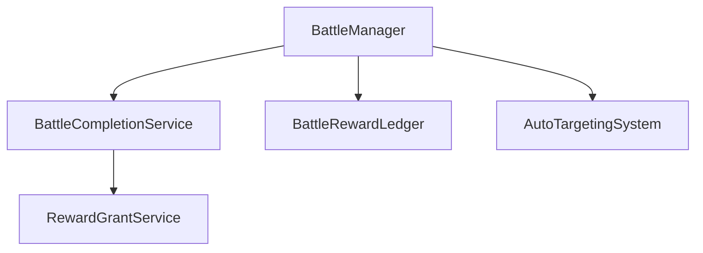

# GDC 피드백 리포트

**작성일:** 2026-03-15  
**프로젝트:** ArrowMaker (Unity 2022.3.62f3, 모바일 2D 게임)  
**GDC 사용 기간:** 2026-03-14 ~ 현재  
**노드 규모:** 296 개 (262 implemented, 34 external)

---

## 📋 개요

이 문서는 ArrowMaker 프로젝트에서 GDC(Graph-Driven Codebase) 를 사용하며 발견된 개선 사항과 피드백을 정리합니다.

---

## 1. ⚠️ 노드 이름 매핑 불명확

### 문제

- 파일 이름과 실제 생성되는 노드 ID 가 일치하지 않는 경우 혼란 발생
- 예시:
  - `GameUiEvents.cs` → `CurrencyChangedEvent` 노드
  - `PullData.cs` → `BannerInfo` 노드
  - `ShopData.cs` → `ShopProduct` 노드
  - `SkillData.cs` → `Skill` 노드
- 같은 파일에 여러 클래스가 있을 때 어떤 클래스가 노드 이름으로 선택되는지 규칙이 불명확

### 개선 제안

```
옵션 1: 파일당 하나의 public 클래스만 허용 (컨벤션 강제)
옵션 2: 파일 내 메인 클래스를 명시하는 어노테이션 추가 (예: // @gdc-node ClassName)
옵션 3: gdc sync 시 매핑 테이블 출력 (--verbose 옵션)
옵션 4: 매핑 로그 파일 생성 (.gdc/sync-mapping.log)
```

### 관련 커맨드

```bash
gdc sync --direction code --verbose
# 또는
gdc sync --direction code --log-mapping
```

---

## 2. 📢 Orphan Info 메시지 과다

### 문제

- `gdc check` 실행 시 217 개의 `[INFO] orphan` 메시지 출력
- 대부분 의도된 엔트리 포인트 (Bootstrap, Manager, Service 등)
- 실제 중요한 경고가 노이즈에 가려짐

### 개선 제안

```yaml
# config.yaml 에 orphan 필터링 옵션 추가
orphan:
  ignore_patterns:
    - "*Manager"
    - "*Service"
    - "*Bootstrapper"
    - "*Data"
    - "*PresentationRef"
  # 또는 entry_point 로 명시한 노드는 orphan 제외
  entry_points:
    - ArrowMakerBootstrapper
    - ArrowMakerData
    - SceneTransitionManager
```

### 관련 커맨드

```bash
gdc check --no-orphan-info
gdc check --orphan-filter "entry-point"
```

---

## 3. 🔧 Draft → Implemented 일괄 업데이트 부재

### 문제

- 217 개 노드를 `draft` → `implemented` 로 수동 변경 필요
- Ralph 에이전트로 자동화했지만, GDC 기본 명령어로 가능해야 함
- 초기 프로젝트 설정 시 많은 시간 소요

### 개선 제안

```bash
# 새로운 명령어 추가
gdc sync --auto-status      # file_path 있으면 implemented 로 자동 설정
gdc status --set implemented --filter "has-file"  # 일괄 상태 변경
gdc migrate --draft-to-implemented  # 기존 draft 노드 일괄 전환
```

### 관련 커맨드

```bash
# 현재는 수동 또는 스크립트 필요
# 새 명령어 예시:
gdc sync --direction code --auto-status
```

---

## 4. 📝 Documentation Warning 과다

### 문제

- `gdc sync --direction code` 실행 시 300+ 개의 "⚠️ X members need documentation" 출력
- 예시 출력:
  ```
  ⟳ Updated: BattleManager
     └─ ⚠️ 24 members need documentation
  ⟳ Updated: CutsceneManager
     └─ ⚠️ 9 members need documentation
  ```
- 개발 흐름 방해, 실제 중요한 경고 식별 어려움

### 개선 제안

```bash
# 옵션으로 제어 가능하게
gdc sync --direction code --no-doc-warnings
# 또는 config.yaml
warnings:
  missing_docs: false  # 기본값 false, CI 에서만 true
  doc_threshold: 5     # X 명 이상일 때만 경고
```

### 관련 커맨드

```bash
gdc sync --direction code --warnings=minimal
gdc sync --direction code --doc-warnings=false
```

---

## 5. 🎯 SRP Violation Threshold 경직성

### 문제

- 의존성 5 개 초과 시 경고 (OfflineRewardCalculator: 6 dependencies)
- 프로젝트 규모/아키텍처에 따라 다른 기준 필요
- Manager 클래스 등은 자연스럽게 의존성이 많을 수 있음

### 개선 제안

```yaml
# config.yaml 에서 프로젝트별 조정 가능
rules:
  srp:
    max_dependencies: 8  # 기본값 5, 프로젝트별 조정
    exclude_patterns:
      - "*Manager"  # Manager 클래스는 예외 (의존성 많을 수 있음)
      - "*Bootstrapper"
    layer_exceptions:
      # 특정 레이어는 더 높은 임계값 허용
      Infrastructure: 10
```

### 관련 커맨드

```bash
gdc check --srp-threshold 8
gdc check --ignore-srp "*Manager"
```

---

## 6. 🔄 양방향 Sync 충돌 처리 명확화

### 문제

- `--direction code` 와 `--direction spec` 동시 실행 시 우선순위 불명확
- 코드와 스펙 모두 변경됐을 때 충돌 해결 가이드 없음
- 팀 작업 시 merge 충돌 가능성

### 개선 제안

```bash
# 충돌 시 명시적 선택 요구
gdc sync --direction both --conflict-prompt
# 또는 전략 지정
gdc sync --direction both --strategy code-wins  # code/spec/merge

# 충돌 로그 생성
gdc sync --direction both --conflict-log .gdc/conflicts.log
```

### 관련 커맨드

```bash
gdc sync --direction both --strategy=code-first
gdc sync --direction both --strategy=spec-first
gdc sync --direction both --strategy=merge-prompt
```

---

## 7. 📊 의존성 그래프 시각화 부재

### 문제

- 노드 간 의존성을 텍스트로만 확인
- 레이어 위반, 순환 의존성 시각적 파악 어려움
- 새로운 팀원이 아키텍처 이해하기 어려움

### 개선 제안

```bash
# 그래프 생성 명령어
gdc graph --output dependency-graph.png
gdc graph --format mermaid  # Mermaid 형식 출력 (Docs 통합용)
gdc graph --layer-violations  # 레이어 위반만 필터링
gdc graph --interactive  # 웹 기반 인터랙티브 뷰어
```

### 출력 예시 (Mermaid)



### 관련 커맨드

```bash
gdc graph --output .gdc/graph.png --format png
gdc graph --output .gdc/graph.md --format mermaid
gdc graph --violations-only
```

---

## 8. 🧪 CI/CD 통합 가이드 부족

### 문제

- `gdc check` 를 CI 파이프라인에서 실행할 때:
  - 종료 코드 (exit code) 규칙 불명확
  - 경고/에러 임계값 설정 방법 없음
  - Unity 빌드와 통합 방법 문서화 부족

### 개선 제안

```yaml
# gdc-ci.yaml 샘플 제공
exit_codes:
  error: 1      # error 있으면 1 반환
  warning: 0    # warning 만 있으면 0 (기본)
  fail_on_warning: true  # CI 에서 warning 도 실패로

thresholds:
  max_errors: 0
  max_warnings: 10
  max_info: 500
```

### GitHub Actions 예시

```yaml
- name: GDC Check
  uses: gdc-action@v1
  with:
    fail_on_warning: false
    max_warnings: 5
    config: .gdc/config.yaml
```

### 관련 커맨드

```bash
gdc check --ci-mode  # CI 친화적 출력 (간결, 종료코드 명확)
gdc check --exit-on-warning  # warning 도 에러로 처리
```

---

## 9. 🛠️ 대규모 프로젝트 성능

### 문제

- 545 개 C# 스크립트, 296 개 노드 동기화 시 시간 측정 불가 (로깅 없음)
- 초기 `gdc init` 후 전체 동기화까지 소요 시간 파악 어려움
- 성능 병목 지점 식별 불가

### 개선 제안

```bash
# 성능 메트릭 출력
gdc sync --timing
# 출력 예시:
# ✓ Synced: 123 updated in 4.2s (29 nodes/sec)
# Parse: 2.1s | Diff: 0.8s | Write: 1.3s

# 프로파일링 리포트
gdc sync --profile --output .gdc/profile.json
```

### 관련 커맨드

```bash
gdc sync --timing --verbose
gdc sync --profile
```

---

## 10. 🏷️ 레이어 정의 및 검증 강화

### 문제

- 현재 레이어: `Domain`, `Application`, `Presentation`, `Infrastructure`, `External`
- 레이어 간 의존성 규칙이 암묵적
- 명시적 규칙 정의와 위반 시 자동 감지 필요

### 개선 제안

```yaml
# config.yaml 에 레이어 규칙 명시
layers:
  order: [Domain, Application, Presentation, Infrastructure]
  rules:
    - from: Domain
      can_depend_on: [Domain]
    - from: Application
      can_depend_on: [Domain, Application]
    - from: Presentation
      can_depend_on: [Domain, Application, Presentation]
    - from: Infrastructure
      can_depend_on: [Domain, Application, Infrastructure]
  
  # 위반 시 에러 또는 경고
  violation_level: error  # error/warning/info
```

### 관련 커맨드

```bash
gdc check --layer-strict  # 레이어 위반을 error 로 처리
gdc graph --layer-violations  # 레이어 위반만 표시
```

---

## 11. 📚 코드 생성 (Spec → Code) 기능 명확화

### 문제

- `gdc sync --direction spec` 이 실제로 어떤 코드를 생성하는지 불명확
- Draft 노드에 대한 스텁 생성 여부/위치/형식 문서화 필요
- 기존 코드와의 충돌 가능성

### 개선 제안

```bash
# 스텁 생성 옵션
gdc sync --direction spec --stub-style interface-first

# 생성 위치/형식 설정 (config.yaml)
codegen:
  stub_prefix: "I"      # 인터페이스 프리픽스
  output_dir: "Generated"
  overwrite: false      # 기존 파일 보호
  namespace_from_path: true  # 폴더 구조에서 네임스페이스 추론
```

### 관련 커맨드

```bash
gdc sync --direction spec --dry-run  # 실제 생성 전 미리보기
gdc sync --direction spec --stub-style=class-first
```

---

## 12. 🌐 인코딩/플랫폼 호환성

### 문제

- Windows PowerShell 환경에서 한글 경로/클래스명 처리 시 인코딩 깨짐 발생
- Bash vs PowerShell 명령어 파싱 차이
- 크로스플랫폼 개발 시 일관성 문제

### 개선 제안

```
- UTF-8 BOM 기본 사용
- PowerShell/Bash 호환 명령어 제공 (gdc.bat, gdc.sh)
- Windows 환경 테스트 명시
- 경로 구분자 자동 처리 (/ vs \)
```

### 관련 커맨드

```bash
# 플랫폼 중립적 실행
gdc init  # Windows, macOS, Linux 모두 동일
```

---

## ✅ 긍정적인 점 (유지 바람)

| 항목 | 설명 |
|------|------|
| **레이어 기반 아키텍처 강제** | SRP, 의존성 방향 인식 향상 |
| **노드 상태 관리** | draft/implemented/external 로 구현 진척도 가시화 |
| **순환 의존성 감지** | 아키텍처 부채 사전 방지 |
| **YAML 기반 스펙** | 버전 관리 용이, 리뷰 가능 |
| **gdc check validation** | 빌드 전 아키텍처 검증 가능 |

---

## 📊 우선순위 추천

| 우선순위 | 항목 | 개발자 영향도 | 구현 난이도 |
|---------|------|--------------|------------|
| **P0** | Orphan 노이즈 필터링 | 즉시 생산성 향상 | 하 |
| **P0** | Draft 일괄 업데이트 | 초기 설정 시간 90% 단축 | 중 |
| **P1** | 노드 매핑 명확화 | 혼란/오작동 방지 | 중 |
| **P1** | CI/CD 통합 가이드 | 팀 도입 장벽 하락 | 하 |
| **P2** | 그래프 시각화 | 아키텍처 이해도 향상 | 상 |
| **P2** | 레이어 규칙 명시화 | 장기적 아키텍처 건강 | 중 |
| **P3** | 성능 메트릭 | 대규모 프로젝트 최적화 | 중 |

---

## 📈 프로젝트 통계

```
Total Nodes: 296
├─ Implemented: 262 (88.5%)
├─ External: 34 (11.5%)
└─ Draft: 0 (0%)

Validation:
├─ Errors: 0
├─ Warnings: 1 (SRP violation)
└─ Info: 217 (orphan)

C# Scripts:
├─ ArrowMaker/Scripts: 123
├─ UJ/Scripts: 162
└─ Total: 545
```

---

## 📬 연락처 및 추가 정보

- **프로젝트:** ArrowMaker
- **Unity 버전:** 2022.3.62f3
- **플랫폼:** Windows 11 (PowerShell)
- **피드백 작성일:** 2026-03-15

---

*이 문서는 GDC 개선을 위한 피드백으로 작성되었습니다.*
